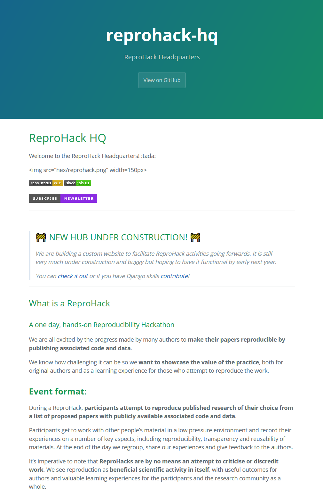
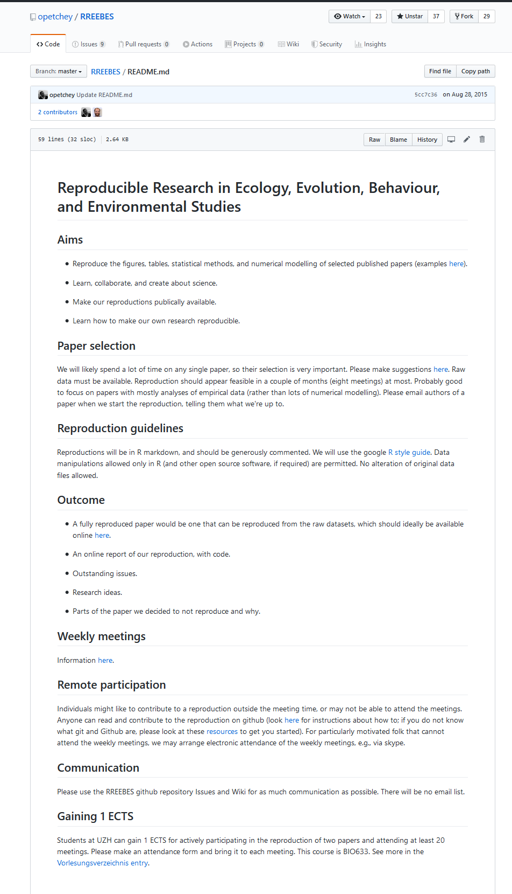

## Why try to reproduce research?

<br>

I believe there's a lot to learn about making your work reproducibile by trying to reproduce real published projects.

---

```{r, out.width = '90%', fig.cap = "https://reprohack.github.io/reprohack-hq/", echo=FALSE}

```

---

```{r, out.width = '90%', fig.cap = "https://github.com/opetchey/RREEBES/blob/master/README.md", echo=FALSE}

```

---

### **Reproducibility vs. Replicability**

<br>

Run author's existing code to achieve the same results as in published paper.

vs. 

Recreate author's analysis with different technical details (e.g. using different software, initial conditions, etc.).


## Goal for today

Learn what it takes to make your science reproducible (no matter where you are starting from).

<br>

### **Think about**

- What can I do right away to make my science more reproducible?
- What can I do later (next month, next year, next project)...?


## Plan of Action

**1. Review paper**

**2. Divy up tasks**

**3. Work on your project!**

**4. Re-group part-way through**

**6. Feedback and take-homes at the end** 


## Reproduction Guidlines

<br>

- Only manipulate data in R; no alteration of original data files

- Use Rmarkdown files, thoroughly comment things

- Use tidy principles (including style) https://style.tidyverse.org/syntax.html


## Code of Conduct

<br>

Event governed by [**Carpentries Code of Conduct**](https://docs.carpentries.org/topic_folders/policies/code-of-conduct.html)

<br>

### Additional Considerations  
  
- #### Reproducibility is hard!
- #### Constructive criticism only please!


## Anticipated hurdles?


## Event Repository  

<br>
https://github.com/SESYNC-ci/reprohack-sesync-Feb-6-2020
  

  
Contains all event information and links to materials.

<br>

Data is located at: "/nfs/public-data/ReproHack_2020"


---

## Mid-point regroup

<br>

Discuss progress and troubleshoot any sticking points.

<br>

- Briefly describe the approach to reproducibility the paper has taken.
- Anything in particular you like about the paper's approach?
- Anything you're having difficulty with?


## Finished early?  Potentially consider publishing the replication?

<br>

Replications could be considered for publication in **ReScience C** Journal

<br>

### [ReScience C](http://rescience.github.io/)

> **ReScience C** is an open-access peer-reviewed journal that targets computational research and encourages the **explicit replication** of already published research, promoting new and open-source implementations in order to ensure that the original research is reproducible.


## Final regroup

<br>

- So, how did you get on? 
- Final comments; other some discussion topics?
- One thing you liked, one thing that can be improved.


## Take-homes

- What can I do right away to make my science more reproducible?
- What can I do later (next month, next year, next project)...?

<br>

**Remember:** It's an iterative process and you don't have to do everything all at once.


## Further Resources

- [**The Turing Way**](https://the-turing-way.netlify.com/introduction/introduction): a lightly opinionated guide to reproducible data science.
- [**Packaging data analytical work reproducibly using R (and friends)**](https://peerj.com/preprints/3192/): how researchers can improve the reproducibility of their work using research compendia based on R packages and related tools


# Thank you all for participating!  


